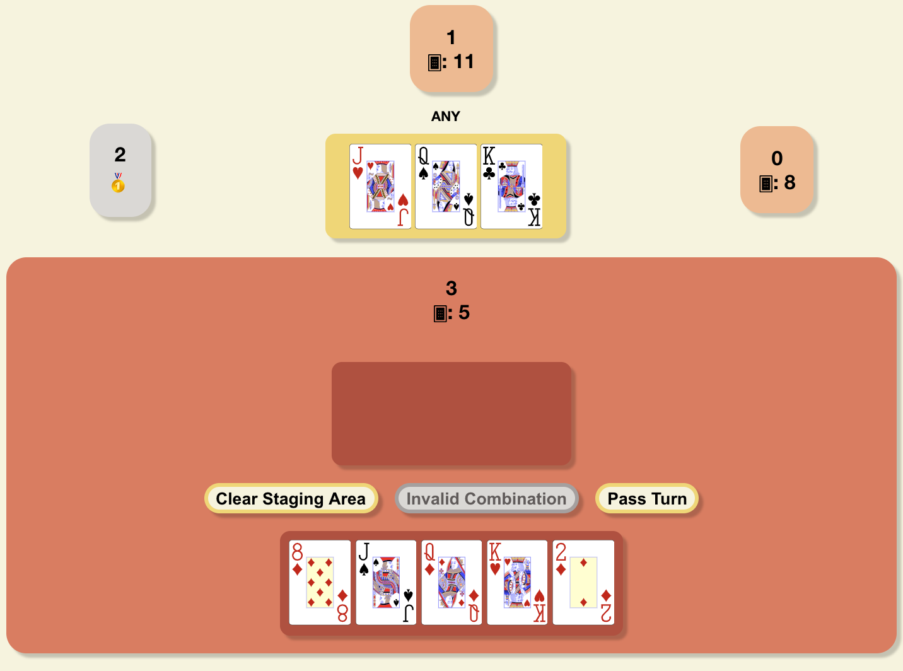

This is an online implementation of the popular Vietnamese card game Tiến Lên, featuring a multiplayer lobby, and a full English ruleset by the rules I learned to play with. You can try out the game at [tienlen-en.herokuapp.com](http://tienlen-en.herokuapp.com/). The rules can be found on the website or [here](https://github.com/nguyenank/tien-len/wiki/Rules).

This project was bootstrapped with [Create React App](https://github.com/facebook/create-react-app). This project uses the [boardgame.io](https://boardgame.io) framework. This project was initially created for HMC CSCI189, Fall 2020.

## Available Scripts

To run the project initially, run `npm install` to install all of the dependencies.

In the project directory, you can run:

### `npm start`

Runs the app in the development mode.  Be sure to change `APP_PRODUCTION` to `false` in `src/config.js`. If you wish to experiment with the game, and not necessarily the Lobby, I would recommend setting `LOBBY` to `false` in `src/config.js,` which runs just the game with the boardgame.io debug panel.

Open [http://localhost:3000](http://localhost:3000) to view it in the browser.

You will also need to run `npm run-script server` to get the web server. By default, the web server is on port 8000. The game server and web server ports can be changed in `src/config.js`.

The page will reload if you make edits. 
You will also see any lint errors in the console.

### `npm test`

Launches the test runner in the interactive watch mode. 
See the section about [running tests](https://facebook.github.io/create-react-app/docs/running-tests) for more information.

### `npm run-script lint` and `npm run-script format`

Lint and format code respectively.

## CREDIT

The playing cards are by Adrian Kennard and can be found (and customised) [here](https://www.me.uk/cards/).
